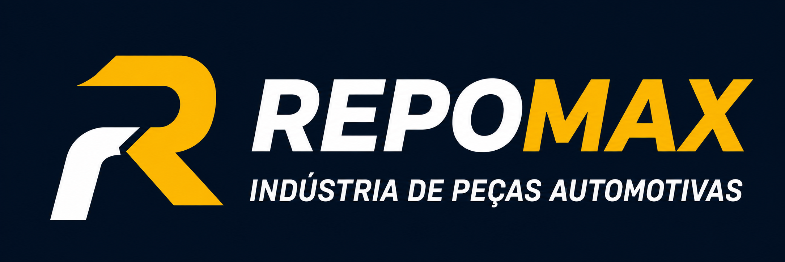

  

  # REPOMAX

  ### Soluções em borracha e suspensão para veículos leves, pick-ups e vans.

  [Sobre o projeto](#sobre-o-projeto) • [Funcionalidades](#funcionalidades) • [Tecnologias](#tecnologias)

---

## Sobre o projeto

Este projeto é o site institucional da **REPOMAX**, desenvolvido para apresentar a empresa, suas linhas de produtos e facilitar o contato com clientes.

O foco da aplicação é oferecer uma navegação direta e visualmente consistente, permitindo que o visitante encontre peças para **Vans**, **Pick-ups** e **Linha Leve** de forma rápida.

## Funcionalidades

- Catálogo de produtos organizado por categoria.
- Busca de produtos por nome ou código.
- Filtros para Vans, Pick-ups e Linha Leve.
- Links de categoria que direcionam o visitante ao catálogo já filtrado.
- Produtos carregados a partir de um arquivo JSON.
- Página de contato com formulário para solicitações e dúvidas.
- Layout responsivo para diferentes tamanhos de tela.

## Tecnologias

  
  
  
  

## Catálogo inteligente

Os produtos são mantidos em `produtos.json`, o que permite ampliar o catálogo sem editar a estrutura HTML da página. Cada produto é classificado automaticamente na linha correta e passa a participar da busca e dos filtros.

Para preservar a experiência de navegação mesmo com um catálogo grande, a página exibe os produtos em lotes de 10 itens.

## Status do projeto

Em desenvolvimento — novos produtos, imagens e informações institucionais podem ser adicionados continuamente.

---

  Desenvolvido para <strong>REPOMAX</strong>.

